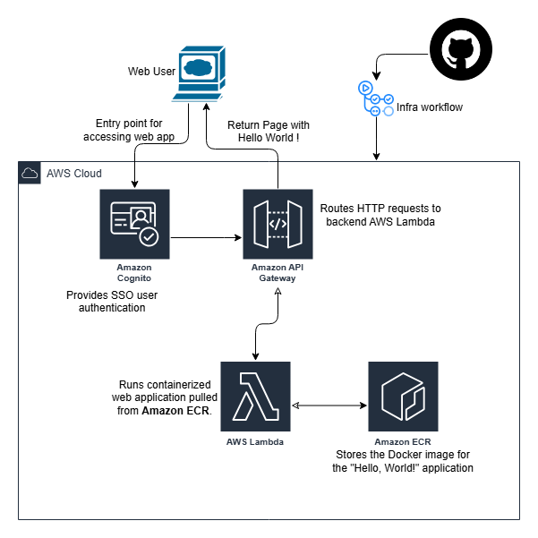

# Hello World!

### Architecture Diagram


Here's a `README.md` file for your GitHub repository:

```markdown
# Hello, World! Web Application on AWS

This project demonstrates how to create a **serverless web application** on AWS that displays "Hello, World!" using **AWS Lambda**, **ECR**, **API Gateway**, and **Cognito** for Single Sign-On (SSO) authentication. The deployment process is automated using **Terraform** and **GitHub Actions** for CI/CD.

## Architecture

- **AWS Lambda**: Serverless function that runs the web application.
- **Amazon ECR**: Containerized web app hosted in AWS Elastic Container Registry.
- **API Gateway**: Exposes the Lambda function to the internet.
- **Amazon Cognito**: Manages Single Sign-On (SSO) authentication.
- **Terraform**: Infrastructure as Code to automate AWS resource creation.
- **GitHub Actions**: CI/CD pipeline to automate deployment.

## Prerequisites

Before you begin, ensure you have the following:

- **AWS Account**: You must have an active AWS account with IAM permissions to create Lambda, API Gateway, ECR, and Cognito resources.
- **AWS CLI**: Ensure that the AWS CLI is installed and configured on your local machine.
- **Terraform**: Install Terraform to manage infrastructure.
- **Docker**: Required to build and push the application container.
- **GitHub Account**: For the GitHub repository and setting up GitHub Actions CI/CD pipeline.

## Getting Started

### Clone the Repository

```bash
git clone https://github.com/<your-username>/hello-world-app.git
cd hello-world-app
```

### Set Up AWS Credentials

Add the following AWS credentials as **GitHub Secrets** in your repository:

- `AWS_ACCOUNT_ID`
- `AWS_REGION` (e.g., `us-east-1`)
- `AWS_ACCESS_KEY_ID`
- `AWS_SECRET_ACCESS_KEY`

### Deploying Infrastructure

1. Navigate to the **terraform** directory:

   ```bash
   cd terraform
   ```

2. Initialize Terraform:

   ```bash
   terraform init
   ```

3. Apply the Terraform plan to deploy the infrastructure:

   ```bash
   terraform apply -auto-approve
   ```

   This will create the following resources:
   - ECR repository for the container image.
   - Lambda function to run the containerized application.
   - API Gateway to expose the Lambda function to the internet.
   - Cognito user pool (for Single Sign-On authentication).

4. Once the deployment is complete, you can retrieve the **API endpoint** from the Terraform output.

### Build and Push Docker Image to ECR

1. Log in to Amazon ECR:

   ```bash
   aws ecr get-login-password --region <your-region> | docker login --username AWS --password-stdin <your-account-id>.dkr.ecr.<your-region>.amazonaws.com
   ```

2. Build the Docker image:

   ```bash
   docker build -t <your-account-id>.dkr.ecr.<your-region>.amazonaws.com/hello-world-app .
   ```

3. Push the Docker image to ECR:

   ```bash
   docker push <your-account-id>.dkr.ecr.<your-region>.amazonaws.com/hello-world-app
   ```

### CI/CD with GitHub Actions

Once you have set up the repository and pushed the changes, **GitHub Actions** will automatically run the deployment workflow:

1. The workflow will trigger on pushes to the `main` branch.
2. It will:
   - Build and push the Docker image to Amazon ECR.
   - Deploy the infrastructure using Terraform.

You can monitor the workflow progress on the **Actions** tab of your GitHub repository.

### Access the Application

Once deployed, you can access the web application through the **API Gateway** endpoint provided by Terraform. You will need to authenticate using Amazon Cognito (SSO) to view the "Hello, World!" message.

## Clean Up

To remove the resources deployed by Terraform:

```bash
terraform destroy -auto-approve
```

## Contributing

Feel free to fork this repository and contribute to it. You can open issues, create pull requests, or suggest enhancements.

## License

This project is licensed under the MIT License - see the [LICENSE](LICENSE) file for details.
```

---

This `README.md` provides a comprehensive guide to set up, deploy, and manage your AWS infrastructure for the serverless web app. Let me know if you'd like any additional sections or modifications!
